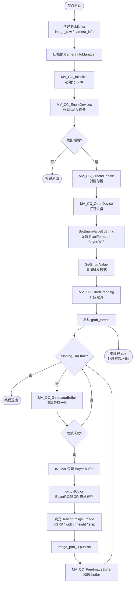

# hik_camera

基于 MVS SDK 和 OpenCV 从零手写的海康工业相机 ROS2 驱动节点，适配 MV-CS016-10UC 等 USB 工业相机。

---

## 依赖项

| 依赖 | 用途 |
|---|---|
| `rclcpp` | ROS2 C++ 客户端库 |
| `sensor_msgs` | Image / CameraInfo 消息类型 |
| `camera_info_manager` | 相机内参管理 |
| `image_transport` | 图像话题传输 |
| `OpenCV` | Bayer 去马赛克（BayerRG8 → BGR8） |
| MVS SDK (`libMvCameraControl.so`) | 海康相机硬件接口 |

MVS SDK 安装：从[海康机器人官网](https://www.hikrobotics.com/cn/machinevision/service/download)下载 Linux `.deb` 包安装，头文件和库文件会安装到 `/opt/MVS/`。

---

## 架构说明

```
┌─────────────────────────────────────────────────────┐
│                  HikCameraNode                      │
│                                                     │
│  构造函数                                            │
│  ├── 创建 Publisher（image_raw、camera_info）        │
│  ├── 初始化 CameraInfoManager                       │
│  ├── SDK：初始化 → 枚举设备 → 创建句柄 → 打开设备   │
│  ├── 设置像素格式 = BayerRG8                         │
│  ├── 关闭触发模式（连续采集）                        │
│  ├── 开始取流                                        │
│  └── 启动取帧线程                                    │
│                                                     │
│  grab_thread（独立线程，不阻塞主线程）               │
│  └── 循环（running_ == true）：                      │
│       ├── MV_CC_GetImageBuffer()  ← 阻塞等帧        │
│       ├── 将 buffer 包装为 cv::Mat（BayerRG8）      │
│       ├── cv::cvtColor → BGR8（去马赛克）            │
│       ├── 填充 sensor_msgs::Image                   │
│       ├── image_pub_->publish()                     │
│       └── MV_CC_FreeImageBuffer()                   │
│                                                     │
│  析构函数                                            │
│  ├── running_ = false（通知线程停止）                │
│  ├── grab_thread_.join()（等待线程退出）             │
│  └── SDK：停止取流 → 关闭设备 → 销毁句柄 → 反初始化 │
└─────────────────────────────────────────────────────┘
```

---

## 运行流程图



---

## 为什么需要独立取帧线程？

`MV_CC_GetImageBuffer()` 是阻塞调用，会等到有帧才返回（最长等待 1000ms）。如果放在主线程里，ROS2 的 `spin()` 就无法执行，导致节点对任何参数修改和外部消息都失去响应。独立线程取帧，主线程专心 spin，两者互不干扰。

---

## 为什么需要 OpenCV 去马赛克？

相机传感器上每个像素前面只贴了一种颜色的滤色片（R/G/B），排列成棋盘格，原始输出（BayerRG8）是单通道数据，无法直接显示彩色。

`cv::cvtColor(bayer, bgr, cv::COLOR_BayerRG2BGR)` 通过对每个像素的周围邻居进行插值，推算出完整的三通道 BGR 彩色图，这个过程称为**去马赛克（Demosaicing）**。

---

## 发布话题

| 话题 | 类型 | 说明 |
|---|---|---|
| `/image_raw` | `sensor_msgs/Image` | BGR8 彩色图，1440×1080，约 90fps |
| `/camera_info` | `sensor_msgs/CameraInfo` | 相机内参（camera_info_manager 管理） |

---

## 编译

```bash
cd ~/ros2_ws
COLCON_PYTHON_EXECUTABLE=/usr/bin/python3 colcon build --packages-select hik_camera
source install/setup.bash
```

> 注意：若系统安装了 Anaconda，必须指定 `COLCON_PYTHON_EXECUTABLE`，否则 colcon 会使用 conda 的 Python，导致找不到 `catkin_pkg` 而编译失败。

---

## 运行

```bash
ros2 run hik_camera hik_camera_node
```

查看图像：
```bash
ros2 run rqt_image_view rqt_image_view
```

查看帧率：
```bash
ros2 topic hz /image_raw
```

---

## 踩过的坑

| 问题 | 原因 | 解决方法 |
|---|---|---|
| 编译报错 `No module named 'catkin_pkg'` | Anaconda Python 覆盖了系统 Python | 编译时加 `COLCON_PYTHON_EXECUTABLE=/usr/bin/python3` |
| rqt 报错 `height * step != size` | `step` 算成了 `nFrameLen / height`，BGR8 应为 `width × 3` | 改为 `frame.stFrameInfo.nExtendWidth * 3` |
| 画面带网格纹路 | encoding 写成 `mono8` 但数据是 Bayer，没有去马赛克 | 加 OpenCV cvtColor，encoding 改为 `bgr8` |
| `PixelFormat` 设置无效 | 参数名拼错为 `PixelFormal` | 改正拼写，确保每次启动强制设置格式 |
