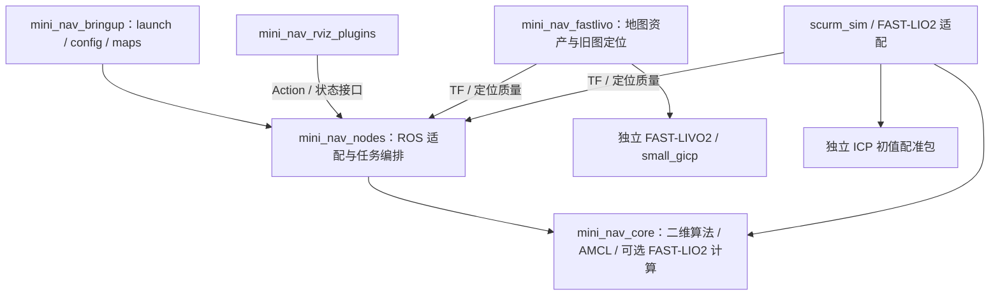
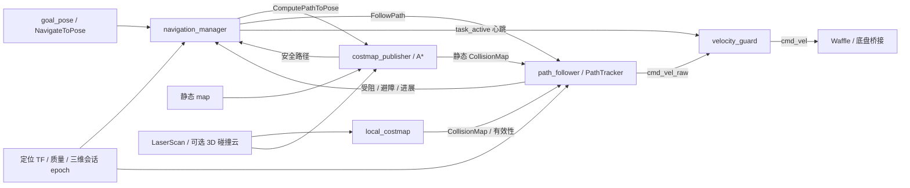

# mini_nav 架构说明

最后更新：2026-10-06

目标平台：ROS 2 Jazzy / TurtleBot3 Waffle

本文描述当前源码的模块职责、数据流和安全接口。阶段记录与各日期验收见 [项目状态](project_status.md)；具体任务操作见 [单目标导航任务](navigation_tasks.md)。当前实现以源码、实际 launch 和日志为准，旧调研方案不直接等同于已实现能力。2026-10-06 的 core/nodes 重构以 Git 留档 `f2218c9` 为基线；改动与本轮验证见 [重构实施记录](../logs/26-10-6/core_node_module_partition_implementation.md)。

## 1. 项目定位与依赖边界

`mini_nav` 已具备基础单目标导航闭环：定位、八邻域 A*、路径后处理、差分路径跟踪、局部障碍处理、重规划、取消/抢占和失联停车。规划、跟踪及默认 AMCL 核心为项目自研实现；FAST-LIVO2 / FAST-LIO2 使用归档或独立部署的上游算法，经项目适配后复用同一导航链。

基础依赖方向为 `mini_nav_bringup → mini_nav_nodes → mini_nav_core`。核心计算不依赖 ROS 消息、节点或 TF。默认二维库不依赖 PCL；可选 `mini_nav_fastlio2_core` 依赖 Eigen/PCL/OpenMP，通过 `MINI_NAV_BUILD_FASTLIO2=ON` 在独立 overlay 构建。节点负责 ROS 适配，bringup 负责配置和运行编排。RViz 插件是观察和操作入口，不承担控制算法。

系统复用安装的 Nav2 地图服务、生命周期管理和 `nav2_msgs` Action 类型，复用 Waffle、Gazebo、桥接及机器人状态发布。标准 Action 接口不意味着已经实现 Nav2 全套行为树、插件或恢复行为。`nav2_learning`、教程包及 `reference/` 中的固定源码快照用于学习和对照，生产代码不依赖它们的私有文件。



## 2. 目录与模块归属

以下是职责目录，省略生成文件、备份和第三方库内部文件：

```text
mini_nav/
├── mini_nav_core/
│   ├── include/mini_nav_core/
│   │   ├── nav_types/                   # 点、位姿、变换、路径
│   │   ├── map/                         # 代价图、膨胀、滚动观测
│   │   ├── collision_checker/           # 碰撞几何、圆盘连续扫掠
│   │   ├── navigator/
│   │   │   ├── planner/                 # A*、路径后处理
│   │   │   └── controller/              # 路径跟踪与候选速度检查
│   │   └── localization/
│   │       ├── amcl/                    # 自研粒子滤波及模型接口
│   │       └── fastlio2/                # 估计器、预处理、普通输入输出类型
│   ├── src/                            # 对应算法目录；nav_types 为头文件
│   │   └── localization/fastlio2/       # IMU、点面观测、IKFoM、ikd-Tree 私有实现
│   └── test/
├── mini_nav_nodes/
│   ├── include/mini_nav_nodes/
│   │   ├── amcl/amcl_node.hpp
│   │   ├── fastlio2/                    # fastlio_node.hpp、sensor_input.hpp
│   │   ├── map_manager/                # 两个地图节点与消息校验/显示辅助
│   │   ├── navigation_task_manager/
│   │   ├── velocity_guard/
│   │   └── tracker_manager/
│   ├── src/
│   │   ├── amcl/amcl_node.cpp
│   │   ├── fastlio2/
│   │   │   ├── fast_lio/src/            # 独立 ROS 包，main.cpp 与 node/*.cpp
│   │   │   ├── icp_relocalization/      # 独立 ICP ROS 包
│   │   │   └── adapter/                 # TF、质量、初值、会话管理
│   │   ├── map_manager/                # costmap_publisher.cpp、local_costmap_node.cpp
│   │   ├── navigation_task_manager/navigation_manager_node.cpp
│   │   ├── velocity_guard/velocity_guard_node.cpp
│   │   ├── tracker_manager/path_follower_node.cpp
│   │   └── main.cpp                     # 六个基础 C++ 节点复用入口
│   ├── msg/CollisionMap.msg
│   └── test/
├── mini_nav_bringup/                    # launch / config / maps / rviz
├── mini_nav_rviz_plugins/               # 导航任务面板
├── mini_nav_fastlivo/                   # 地图资产与独立 FAST-LIVO2 部署
├── mini_nav_fastlio/                    # scurm_sim、构建工具与源文件清单
├── mini_nav_pf_debug/
├── scripts/
├── docs/
├── logs/                               # 按日期保存的报告
└── reference/                          # 隔离的官方源码对照
```

`mini_nav_nodes` 的六个 C++ 可执行程序都由 [main.cpp](../mini_nav_nodes/src/main.cpp) 按构建宏选择节点；AMCL 没有另设 `amcl_main.cpp`。FAST-LIO2 目录中的独立包使用自身入口，FAST-LIO2 节点链接可选计算库，ICP 包保留自己的入口；它们不加入默认二维核心库。

`mini_nav_fastlio/COLCON_IGNORE` 隔离独立三维部署，构建脚本显式指定 `--base-paths`。`src/scurm_deploy` 保留兼容链接。手柄包 `mini_nav_teleop` 位于工作区同级 [src/mini_nav_teleop](../../mini_nav_teleop/)，不在本目录内部。源文件迁移与固定版本见 [定位后端目录说明](localization_backends.md)。

## 3. 单目标导航数据流

完整导航入口使用下列链路。RViz 目标先转为有身份的任务；完整入口关闭规划器的直接 topic 目标，跟踪器启用 Action 模式，避免两条控制路径竞争。



| 节点 | 主职责 | 不应承担的职责 |
|---|---|---|
| `costmap_publisher_node` | 接收或加载地图，生成规划代价，融合观测，提供 ComputePathToPose，发布路径与静态碰撞快照 | 发布底盘速度、修改定位输入地图 |
| `mini_nav_amcl_node` | 生命周期、消息转换、初值、激光时间 TF、粒子滤波调用、定位质量 | 访问位姿分箱内部、编排导航任务 |
| `local_costmap_node` | 维护 odom 滚动观测、连续扫描端点、覆盖和有效性 | 把显示膨胀图当作原始观测再次融合 |
| `path_follower_node` | FollowPath、输入新鲜度门控、调用跟踪器、输出已检查候选 | 直接接受完整入口的 RViz 目标、绕过守卫 |
| `navigation_manager_node` | NavigateToPose、子 Action、目标身份、取消/抢占、重规划、期限与运动许可 | 直接计算速度、执行无限重试 |
| `velocity_guard_node` | 独立稳态时钟看门狗，唯一转发到 `/cmd_vel` | 再次平滑候选、在失效时恢复旧命令 |

任务节点使用任务代次与子目标 UUID 排除迟到结果。重规划前撤销运动许可并取消旧 FollowPath；新规划失败时不能恢复旧路径。地图变化、重新设置初值、三维定位 epoch 变化或暂停都会使旧任务失效，恢复后需要新目标。

默认服务器响应期限为 3 s，重规划间隔至少 1 s，持续受阻或无进展期限为 20 s，总任务期限为 180 s。期限用稳态时钟，重规划不重置总期限。跟踪器另有局部进展检查，不能用其重置替代任务总期限。

## 4. 二维核心接口

### 4.1 地图与规划

[Costmap2D](../mini_nav_core/include/mini_nav_core/map/costmap_2d.hpp) 保存二维几何和格代价，负责边界、容量、有限数与坐标转换校验。静态占用输入转换后，自由格为 0、致命障碍为 254、未知为 255；显示/规划膨胀另行生成，定位用原图保持不变。

[InflationLayer](../mini_nav_core/include/mini_nav_core/map/inflation_layer.hpp) 生成膨胀代价；[AStarPlanner](../mini_nav_core/include/mini_nav_core/navigator/planner/astar_navigator.hpp) 使用八邻域搜索和八方向几何启发式。步长为 1 或 √2，软代价按 `步长 × (1 + cost_travel_multiplier × 目标格代价 / 252)` 累加。对角边禁止穿过侧方禁行区域。

生产规划调用带 `CollisionGeometry`、真实起点、可选起点/终点专用几何的 Plan 重载。显示图提供路径偏好，连续几何决定硬安全；仅检查格代价的旧重载仍保留，不能代替完整入口的车体校验。

真实起点先检查当前车体，再以安全连续连接接入所属或八邻接格中心，允许多个搜索根。原目标优先；不可达时在默认 0.5 m 目标容差内选最近可达安全格，距离相同再比较路径代价。越界目标仍失败，不通过容差放宽障碍规则。

[路径后处理](../mini_nav_core/include/mini_nav_core/navigator/planner/path_postprocessor.hpp) 简化、加密并有限轮平滑路径，每次改点检查相邻段，最终复查整条路径。平滑不安全时退回已经验证的原路径；原路径本身不安全则返回空。发布路径包含实际起点连接，不能凭“有 Path 消息”认定可执行。

### 4.2 路径跟踪

[PathTracker](../mini_nav_core/include/mini_nav_core/navigator/controller/path_tracker.hpp) 接收连续路径和终点朝向，Step 输入 map/odom 位姿、两帧关系、静态及局部碰撞几何、稳态时间，返回速度及诊断。ROS 新鲜度和 Action 生命周期由节点处理。

默认名义控制采用前视点方向与差分运动约束。0.35 m 前视点的直达捷径若不安全，只有当前点至最近路径投影和原折线前段均安全时，才沿原折线逐次减半前视距离，最多 12 次。原路径受阻时仍执行原有候选检查和停车逻辑；这项修复保留了硬安全预算。

候选先限速和限加速度，再检查真实转弯运动、反应距离、制动行程及圆弧离散补偿。静态与局部几何都通过才输出。名义候选失败时尝试少量合法替代候选，单轮替代最多 3 s；无安全候选输出零速，阻挡状态锁存避免反复零速重试。未实现默认倒车或初始车体重叠脱离。

默认完整入口为 10 Hz、线速度上限 0.15 m/s、角速度上限 0.55 rad/s，线加速度 0.30 m/s²、减速度 0.50 m/s²、角加速度 1.0 rad/s²。终点位置容差 0.12 m、朝向容差 0.15 rad。以上来自运行 YAML；核心参数默认值和独立节点模式可能不同。SCURM 入口另外设置 0.03 m 终点位置滞回。

## 5. 观测、碰撞几何与误差预算

### 5.1 三种地图语义

| 数据 | 作用 | 安全解释 |
|---|---|---|
| 原始静态地图 | 定位输入和静态几何 | 障碍与未知按整个格面积检查，包含地图边界 |
| 膨胀规划/显示图 | 软代价、RViz 显示与对照 | 膨胀颜色不替代连续车体检查 |
| 局部观测与 CollisionMap | 当前覆盖、动态端点、原始碰撞格 | 二维端点连续检查；未知和不透明格保守检查 |

[RollingObstacleGrid](../mini_nav_core/include/mini_nav_core/map/rolling_obstacle_grid.hpp) 按整数格移动窗口，同时维护格状态、观测时间和连续端点。射线清除后登记命中；过期观测恢复未知，不当作自由。默认 odom 窗口为 4 × 4 m、0.05 m/格，发布 5 Hz，观测保留 2 s；扫描最大年龄 1 s，跟踪器局部快照最大年龄 0.8 s。

LaserScan 端点用扫描时间的 TF 变换，当前生产链保留真实端点于 `odom`。格用于索引、软代价、显示及观测覆盖，不能把已经栅格化/膨胀的局部图再次面积投影到全局。可选三维碰撞云生成的障碍格仍按格面积保守检查，不能假定与精确二维端点具有相同的量化误差。

### 5.2 统一连续几何

`CollisionGeometry` 位于 [collision_geometry.hpp](../mini_nav_core/include/mini_nav_core/collision_checker/collision_geometry.hpp)，由原始格、连续点、车体半径、观测误差和帧关系组成。[CollisionChecker](../mini_nav_core/include/mini_nav_core/collision_checker/collision_checker.hpp) 实现连续扫掠。它允许格和端点分别使用误差预算，把待检查运动转换到端点帧。A* 边、真实起点连接、路径后处理和控制候选共用 `IsClear` 圆盘扫掠。

当前预算为：

| 几何对象 | 基础预算 | 额外约束 |
|---|---|---|
| map 静态障碍格、未知与边界 | 0.24 m 车体 + 0.02 m 安全余量 + 0.03 m 地图定位误差 = 0.29 m | 格按完整面积检查 |
| odom 实时 LaserScan 端点 | 0.26 m 车体与余量 + 0.03 m 观测误差 = 0.29 m | 相对距离不重复叠加绝对地图定位误差 |
| 兼容的 map 同帧扫描端点 | 0.29 m + 0.03 m 观测误差 = 0.32 m | 保留旧同帧保守预算 |
| 规划终点 | 上述相应几何预算 | 再覆盖控制器允许的完整 0.12 m 停车圆盘 |

0.5 m 是替代终点搜索范围，0.12 m 是到达停车位置容差，两者作用不同。静态地图定位预算没有因扫描相对帧修复而缩小，未知区域也没有改为可通行。

默认 `dynamic_policy=static_then_stable`：全局初始路线以静态硬几何为主，动态观测参与软代价，起点、终点和局部控制立即检查全部当前观测。持续受阻后，连续至少 3 次扫描、跨度至少 0.3 s、扫描间隔不超过 1.5 s 的稳定当前端点加入全局硬约束。局部停车不等待稳定判据成立。

共享配置的显示膨胀内切半径为 0.22549849949589046 m，膨胀半径 0.70 m，衰减系数 3.0；FAST-LIVO2 导航入口覆盖后两项为 0.32 m / 16.0。它们用于路径偏好，不等于 0.26 m 车体安全圆，也不替代静态地图的 0.29 m 预算。详细说明见 [规划代价地图](planning_costmap.md)和[局部代价地图](local_costmap.md)。

### 5.3 CollisionMap 原子快照

[CollisionMap.msg](../mini_nav_nodes/msg/CollisionMap.msg) 定义于 `mini_nav_nodes`，不存在额外的 `mini_nav_interfaces` 包：

```text
nav_msgs/OccupancyGrid grid
geometry_msgs/Point[] points
float64 observation_uncertainty
float64 clearance_radius
bool valid
string points_frame_id
```

`grid.header` 表示格帧及观测时间；`points_frame_id` 明确端点帧，空值兼容格与点同帧。`clearance_radius` 为格使用的预算，点的独立半径由解码后的几何契约指定。格、点、预算和有效性同消息更新，避免订阅者拼接不同时刻的数据。

[DecodeCollisionMap](../mini_nav_nodes/include/mini_nav_nodes/map_manager/collision_map.hpp) 检查 valid、允许的格/点帧、有限正预算、分辨率、尺寸与容量、数据长度、格姿态及端点有限数。只接受 -1/0/100 的原始占用语义，拒绝把软膨胀图作为碰撞输入。节点还检查静态/局部预算是否与自身配置一致。无效或过期输入撤销运动能力。

消息增加 `points_frame_id` 后需同步构建并完整重启各消费者；构建不会热更新已有进程。

## 6. 自研 AMCL

AMCL 算法实现在 `mini_nav_core/src/localization/amcl/`，公开接口位于 `include/mini_nav_core/localization/amcl/`。ROS 节点只传入普通 C++ 数据，不让核心直接使用 LaserScan 或 TF。

| 核心模块 | 职责 |
|---|---|
| `LocalizationMap` | 只读定位地图、距离场、射线距离与自由位置采样 |
| `DifferentialMotionModel` | 差分里程计增量与噪声采样；alpha1–4 生效，alpha5 保留兼容 |
| `LikelihoodFieldModel` / `BeamModel` | 基于普通 `LaserScanData` 的粒子观测似然 |
| `PoseBinIndex` | 位姿分箱、占用箱计数和连通主簇，处理 yaw 周期边界 |
| `ParticleFilter` | 持有运动/激光模型，初始化、预测、观测、归一化、重采样及主簇估计 |
| `pose_utils` / `types` | AMCL 数据与协方差辅助；位姿、角度和变换复用 `nav_types` |

`PoseBinIndex` 的文件名仍为 `kd_tree.hpp/cpp`；当前实现是位姿分箱索引，不能仅凭文件名解释成通用 KD-tree。`AmclNode` 通过 ParticleFilter 接口调用，不访问分箱细节。估计采用可信主簇，避免多个远离的粒子峰直接取全体平均。

AmclNode 是 LifecycleNode，由地图/AMCL 生命周期管理器管理。回调组自动加入 executor，`main.cpp` 正常 spin 即可调度地图、初值和激光回调。

粒子更新与 TF 刷新解耦：运动未超过更新阈值时不重新滤波，但按扫描时间加 transform_tolerance 重发最近有效几何。地图替换、初值重置、全局定位及 cleanup/shutdown 使缓存失效。TF 在刷新只表示变换可用，定位有效还要求激活状态、可信主簇、有限协方差及新鲜观测等条件。

KLD 仍为简化自适应实现，beam-skip 和位姿持久化等兼容参数不能据此认定已实现。源码承接关系见 [官方 AMCL 代码导读](../logs/26-8-30/amcl_code_walkthrough.md)。

## 7. FAST-LIVO2 地图与旧图定位

[mini_nav_fastlivo](../mini_nav_fastlivo/README.md) 独立封装地图资产、会话、高度投影和配准，不复制 A* 或跟踪器。FAST-LIVO2 前端来自独立部署的固定上游版本；small_gicp 固定 1.0.1，依赖安装于工作区私有目录。

建图入口启动前端、height_mapper 和可选手柄/外部控制，不启动 NavigateToPose。保存服务生成新目录，绑定三维 `geometry.pcd`、二维 `navigation.yaml/pgm`、标定关系、观测缓存和哈希清单。三维定位图与二维导航图须属于同一坐标关系，彩色显示云不能替代绑定资产。

导航入口校验并只读加载 map_bundle，启动 prior_localizer、地图服务及完整自研导航链。人工 `/initialpose` 给出局部 GICP 初值；配准将前端观测约束到旧图，发布动态 map → odom 和定位质量/epoch。导航不启动全局地图累积/保存节点；前端内部局部几何与视觉参考仍更新，未恢复旧图的完整视觉状态，也没有全局地点搜索。

离线模块记录完整去畸变 IMU 点云和同时间戳位姿，严格检查记录及哈希。停止建图后，默认 `finalize_map --backend probability` 重放完整扫描射线，生成新候选包，保留原会话和地图。当前在线布尔累积预览不是离线结果。

`hba` 和 `pose_graph` 是显式可选实验后端：前者生成优化与原轨迹对照；后者使用平地 SE(2) 扫描约束校正历史轨迹。代码及注册测试存在不等于长程闭环或地图改进已经验收；已有 HBA 首轮对照未改善墙厚。最终重放完整扫描，不能把粗优化云直接当碰撞地图。实现路径为 [offline.py](../mini_nav_fastlivo/mini_nav_fastlivo/offline.py)与[pose_graph.py](../mini_nav_fastlivo/mini_nav_fastlivo/pose_graph.py)。

`bind_static_map` 可将三维定位资产与已有二维静态图绑定并保留原图文件及元数据；这类组合的坐标与可选三维碰撞云需单独验证。平地自由空间假设不证明整个车高柱都已观测，坡道、悬空障碍、负障碍、动态物体剔除和长期漂移仍有验证缺口。离线证据见 [墙体验证报告](../logs/26-10-4/offline_wall_validation_report.md)。

## 8. SCURM FAST-LIO2 先验定位

本入口使用归档的 `PolarisXQ/SCURM_SentryNavigation@46e6425c692ec98f8e65446fb6fdd360f44ef8e5` 源码，保留上游内核与许可。三维估计、IMU 初始化/去畸变、点云预处理和点面观测在 core 的 fastlio2 目录，封装为独立计算库。独立 `fast_lio` 包链接导出的 CMake target，不再直接编译 core 私有文件。节点内按参数、传感器输入、估计调度和 ROS 输出分文件；不会链接进入基础二维库。

正式入口 `scurm_sim/fastlio2_navigation.launch.py` 启动仿真、地图、定位适配和完整自研导航链，不启动 AMCL、LIVO2 或上游 SCURM 的 Nav2 导航插件。旧 `mini_nav_fastlio.launch.py` 保留兼容。

backend 管理自身 ICP / FAST-LIO2 子进程和唯一会话。初值由 map 车体位姿转换到 IMU；邻域 ICP 连续有效后进入固定先验 ikd-tree 定位，不增量写入先验地图。再次设置初值时只停止并重启自身子进程，仿真保留，旧导航任务失效。

轮式里程计保持连续 odom → base_footprint；前端输出私有 `scurm_lio_odom`，自身底盘 TF 发布关闭。适配器在同一测量时刻组合定位车体位姿与插值轮式位姿：

```text
T_map_odom(t) = T_map_base(t) × inverse(T_odom_base(t))
```

质量检查包括匹配点数/比例/点面残差、IMU/扫描/轮式数据年龄、位姿和协方差有限性、时钟及跳变；有前端进程不代表有效定位。初始化、后端重启和质量失效撤销旧运动许可。固定先验仍需要合理人工初值，未实现未知位置全局重定位。

源文件清单、独立 overlay 和运行步骤见 [定位后端目录说明](localization_backends.md)与[人工初始化验收](../logs/26-10-4/scurm_fastlio2_initialpose.md)。

## 9. ROS 接口、TF 与运行所有权

| 接口 | 类型/帧 | 生产者与用途 |
|---|---|---|
| `/map` | OccupancyGrid / map | 地图服务，定位与规划原始输入 |
| `/mini_nav/planning_costmap` | OccupancyGrid / map | 规划器，显示软代价 |
| `/mini_nav/global_path` | Path / map | 规划器，观察结果；完整入口以 Action 交付控制 |
| `/mini_nav/static_collision_map` | CollisionMap / map，点可 odom | 规划器，静态及相应动态约束原子快照 |
| `/mini_nav/local_collision_map` | CollisionMap / odom | 局部图节点，当前观测与覆盖 |
| `/mini_nav/local_costmap_valid` | Bool | 局部图节点，新鲜度和输入有效性 |
| `/mini_nav/localization_valid` | Bool | 当前定位后端，供任务与跟踪器门控 |
| `/mini_nav/localization_epoch` | String | 三维适配器，会话切换使旧任务失效 |
| `/initialpose` | PoseWithCovarianceStamped / map | RViz 或用户，重新初始化定位 |
| `/navigate_to_pose` | NavigateToPose Action | 任务节点，单目标反馈/结果/取消/抢占 |
| `/compute_path_to_pose` | ComputePathToPose Action | 规划器；ID 留空、AStar 或 AStarDynamic |
| `/follow_path` | FollowPath Action | 跟踪器；ID 留空或 PathTracker |
| `/mini_nav/task_active` | Bool | 当前控制模式的许可与持续心跳 |
| `/mini_nav/cmd_vel_raw` | TwistStamped / base_footprint | 当前控制源，已经检查的候选 |
| `/cmd_vel` | TwistStamped / base_footprint | 唯一 velocity_guard，底盘实际 ROS 输入 |
| `/mini_nav/set_navigation_enabled` | SetBool service | 任务暂停/启用；启用不恢复旧目标 |
| `/mini_nav/control_diagnostics` | String / JSON | 跟踪器，候选、冲突、预算和时间信息 |

传感器使用 SensorDataQoS；静态地图/路径与保留状态使用 reliable/transient_local，局部碰撞、有效性、原始速度和任务租约使用 reliable 的实时流。订阅成功不替代时间戳及接收年龄检查，保留状态也不代表当前有效。

必须保持以下运行所有权：

- 一个有效定位后端动态发布 map → odom；禁止用静态 map → odom 代替定位。
- 轮式/仿真里程计发布 odom → base_footprint；机器人状态发布器管理车体和传感器外参。
- 完整控制模式只有一个 velocity_guard 发布 `/cmd_vel`，只有一个获授权原始命令源和许可源。
- 地图输入及各输出图避免重复发布者；隔离 ROS_DOMAIN_ID 和 GZ_PARTITION。

守卫每 20 ms 用墙定时器检查，命令/租约默认 0.35 s 超时；时钟停滞或回跳、非法帧/速度/时间戳及关闭均输出零速。守卫不再平滑命令，保证转发的是跟踪器检查过的候选。守卫自身或桥接故障仍依赖底盘驱动超时，软件节点不等于硬件急停。

手动控制使用同一 raw → guard 接口，PS5 面板提供开关及限速，手动入口可配置到 2 m/s、2 rad/s。它与自主导航目前是独立启动模式，未实现共享仲裁器或自动热接管；FAST-LIVO2 建图入口拒绝同时启用手柄和外部控制。不能把手动上限写成自主默认值。

## 10. 启动入口与构建边界

| 入口 | 启动内容 | 默认隔离/边界 |
|---|---|---|
| [mini_localization_astar.launch.py](../mini_nav_bringup/launch/mini_localization_astar.launch.py) | 自研 AMCL、地图、完整导航链、Waffle/RViz | 域 61 / mini_nav；支持关闭仿真或 RViz |
| [official_localization_astar.launch.py](../mini_nav_bringup/launch/official_localization_astar.launch.py) | 官方 AMCL + 地图服务、自研规划和局部图、Waffle/RViz | 继承外部域/分区；未启动任务、跟踪器或速度守卫 |
| [fastlivo_mapping.launch.py](../mini_nav_bringup/launch/fastlivo_mapping.launch.py) | FAST-LIVO2 建图、记录、手动或外部控制 | 域 219 / mini_nav_fastlivo_deploy；没有自主导航 |
| [fastlivo_navigation.launch.py](../mini_nav_bringup/launch/fastlivo_navigation.launch.py) | FAST-LIVO2 前端、旧图局部定位、完整导航链 | 域 219 / mini_nav_fastlivo_deploy；必需 map_bundle |
| [fastlio2_navigation.launch.py](../mini_nav_fastlio/scurm_sim/launch/fastlio2_navigation.launch.py) | SCURM FAST-LIO2 先验定位、完整导航链 | 域 227 / scurm_mini_nav；独立安装 overlay |
| [fastlivo_slam_benchmark.launch.py](../mini_nav_bringup/launch/fastlivo_slam_benchmark.launch.py) | 同次运动比较 FAST-LIVO2 与 SLAM Toolbox 地图 | 域 228 / mini_nav_slam_benchmark；实验对照入口 |
| [waffle_sim.launch.py](../mini_nav_bringup/launch/waffle_sim.launch.py)、[sim_check.launch.py](../mini_nav_bringup/launch/sim_check.launch.py) | 仿真及接口检查 | 不提供定位替代 TF 或完整导航 |
| [start_astar_navigation.sh](../scripts/start_astar_navigation.sh) | 独立静态地图/路径演示 | 不自动提供仿真、定位或完整控制链 |

官方定位对照入口只比较定位与自研规划，不能按默认自研入口的方式期待机器人自动跟踪路径，也不是整套官方 Nav2。

基础入口使用包 share 查找资源，默认静态地图为 `mini_nav_bringup/maps/tb3_learning.yaml/pgm`（112 × 103、0.05 m/格、原点 -0.961/-2.072），保留 `map:=...` 覆盖。自研 AMCL 和 map_server 是生命周期节点；任务、局部图、跟踪器和守卫是普通节点，统一暂停服务不等于整套 Lifecycle cleanup。

基础构建与测试从工作区根目录进行：

```bash
cd /home/a/ros2_ws
source /opt/ros/jazzy/setup.bash
colcon build --packages-select mini_nav_core mini_nav_nodes mini_nav_bringup mini_nav_rviz_plugins
source install/setup.bash
colcon test --packages-select mini_nav_core mini_nav_nodes mini_nav_bringup mini_nav_rviz_plugins --event-handlers console_cohesion+
colcon test-result --verbose
ros2 launch mini_nav_bringup mini_localization_astar.launch.py --show-args
```

FAST-LIVO2 使用 [tools/build.sh](../mini_nav_fastlivo/tools/build.sh)及 `install_fastlivo` 前端依赖；离线概率重放/HBA 通过独立工具构建，私有 PCL/GTSAM/OctoMap 依赖不加入二维核心库。FAST-LIO2 使用 [build_localization.sh](../mini_nav_fastlio/scripts/build_localization.sh)和 `install_mini_nav_fastlio`。详细 source 顺序按各包说明执行，不能仅构建三包便认为三维后端已准备好。

## 11. 验证证据与当前边界

架构约束需要分层验证：核心检查几何与算法边界；真实节点检查消息、Action、取消/抢占、输入失效和守卫；隔离 Gazebo 检查实际运动、终点、停车及 TF/速度发布所有权。RViz 面板需要可用图形环境。测试数量应按当前注册用例统计，不能把历史 XML 和 CTest 包装总数当作实际用例。

本轮 [模块重构实施记录](../logs/26-10-6/core_node_module_partition_implementation.md)记录默认五包与独立三维四包构建、133 个实际用例及隔离 Gazebo 人工初值/运动中重定位/新目标到达通过；本轮没有 GUI 人工验收。

此前 [第二轮复发问题报告](../logs/26-10-6/recurrent_failure_02_assessment.md)记录 104 个实际用例（core 76、nodes 27、RViz 1）、原始路径真实节点回放和 6 个连续 Gazebo 目标通过；[前一轮报告](../logs/26-10-6/recurrent_failure_assessment.md)记录扫描帧预算修复、103 个用例和 7 次任务。它们表示各轮有限场景的已有验收，历史验收不能外推为全部地图、后端及噪声组合都已通过。

当前仍未实现或完成普遍验收的部分包括：

- Nav2 全套行为树/插件、多目标任务、通用恢复序列与路径速度反馈闭环。
- 全部组件统一生命周期、实时调度、共享手动/自动仲裁和硬件急停。
- 自研 AMCL 的完整官方功能等价、三维后端无初值全局重定位。
- 三维地图长程闭环质量、复杂地形、动态物体离线剔除及实车运行。
- 各定位后端在同一地图、重复连续目标和失效注入下的统一长期回归。

维护时，普通二维地图与几何算法放 core，ROS 输入校验和 Action 适配放 nodes，运行选择与参数放 bringup；三维前端依赖继续隔离。修改碰撞接口要同时核对规划、后处理、跟踪和消息消费者，保留原始地图及用户注释，不能通过放宽半径掩盖建图或坐标问题。
