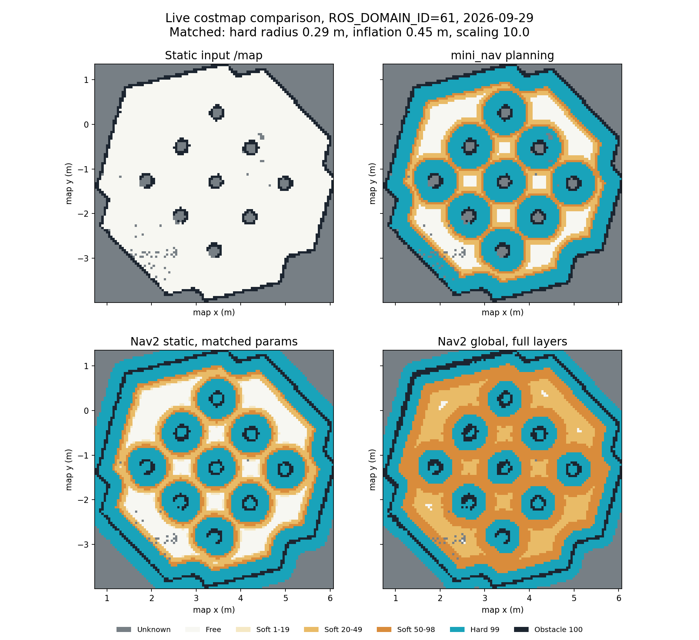
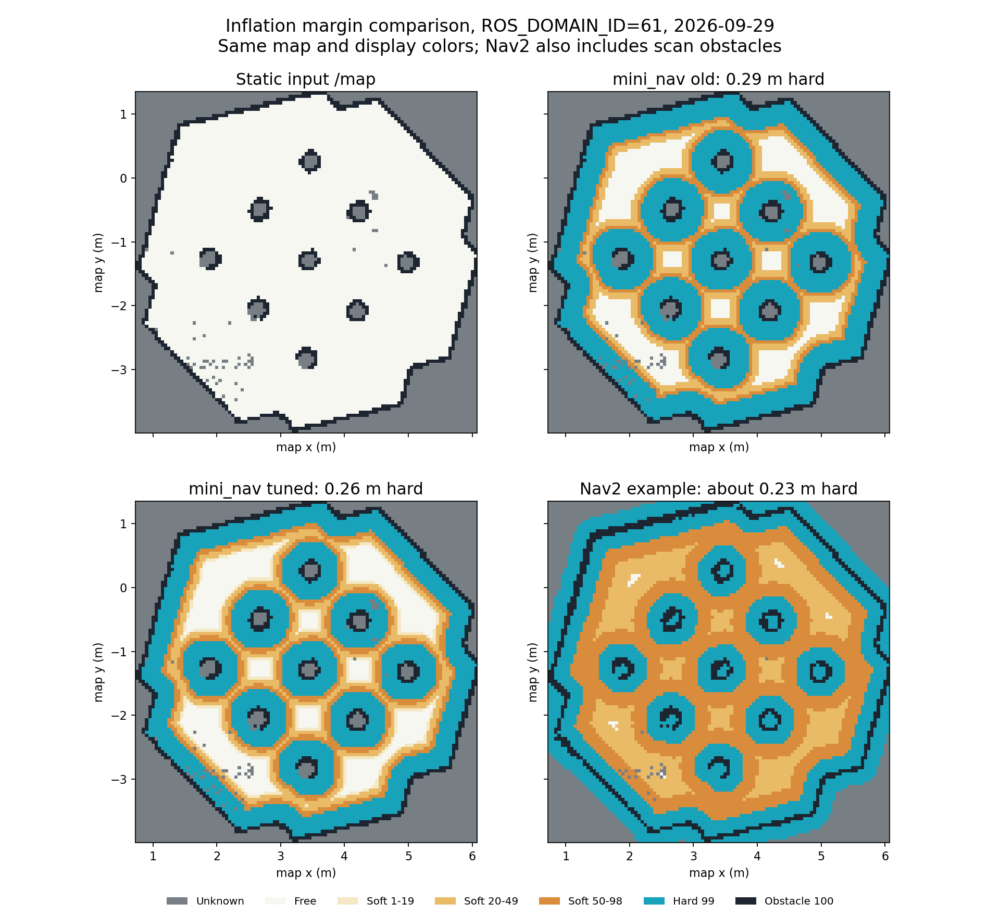

# 用官方 Nav2 代价地图对照自研实现

备份点为 Git 提交 `2996b61`，同时保留分支
`backup/mini-nav-before-official-costmap-20260929`。

`nav2_costmap_compare.launch.py` 启动 Jazzy 安装包中的三个独立
`nav2_costmap_2d` 节点及其生命周期管理器：

- 全局图：官方 `StaticLayer → ObstacleLayer → InflationLayer`；
- 参数对齐图：官方 `StaticLayer → InflationLayer`，只比较静态地图膨胀；
- 局部滚动图：官方 `VoxelLayer → InflationLayer`。

代价计算、图层合并与 OccupancyGrid 发布均由官方程序执行。
`reference/nav2_costmap_2d_jazzy` 只用于阅读源码，运行时不从该目录加载私有文件。
独立 `Costmap2DROS` 启动后能进入 active，但不会像普通 Nav2 服务节点那样
在 `on_activate()` 中调用 `createBond()`；因此这里为三个独立生命周期管理器
设置 `bond_timeout: 0.0`，避免管理器把正常激活错报为 bond 超时。

三张官方图与自研图处于同一 ROS 域。全局图读取现有 `/map`、`/scan`
和 TF；参数对齐图只读取 `/map` 和 TF；局部图读取 `/scan` 和 TF。
对照配置取自 `src/nav2_learning/config/nav2_params.yaml` 的代价地图部分：
官方示例机器人半径 0.22 m、足迹 padding 0.01 m、膨胀半径 0.70 m、衰减系数
3.0。只将 `robot_base_frame` 设为 mini_nav 使用的 `base_footprint`，并给
节点加独立命名空间。自研图使用 0.24 m 半径、0.02 m 安全余量、
0.45 m 膨胀半径和 10.0 衰减系数。参数对齐图相应使用官方
`robot_radius: 0.26`、`footprint_padding: 0.0`、膨胀半径 0.45 m 和衰减系数 10.0，
排除上述参数及扫描障碍的影响。

先启动已有的自研定位示例；若它已经运行，直接执行第二段即可：

```bash
cd /home/a/ros2_ws
source /opt/ros/jazzy/setup.bash
source install/setup.bash
export ROS_DOMAIN_ID=61
export GZ_PARTITION=mini_nav
ros2 launch mini_nav_bringup mini_localization_astar.launch.py
```

在另一终端使用同样的 ROS 域和 Gazebo 分区：

```bash
cd /home/a/ros2_ws
source /opt/ros/jazzy/setup.bash
source install/setup.bash
export ROS_DOMAIN_ID=61
export GZ_PARTITION=mini_nav
ros2 launch mini_nav_bringup nav2_costmap_compare.launch.py
```

第二个 RViz 窗口默认叠加显示 **Nav2 Matched Static Costmap** 与
**Nav2 Local Costmap**，可直接观察 `odom` 局部窗口随机器人移动。
要单独比较静态膨胀边界，先关闭 **Nav2 Local Costmap**，再切换
**Nav2 Matched Static Costmap** 和 **Self Planning Costmap**；
**Nav2 Global Costmap** 展示官方扫描层叠加后的结果。
局部图仍因窗口大小、感知与超时策略不同而不可逐格直接相减。
自研 A* 继续使用自身生成的规划图，并将它发布到
`/mini_nav/planning_costmap` 供查看；官方图不发车速指令。

## 2026-09-29 调整前同图实测



这张快照保存于自研安全余量仍为 0.05 m、硬半径为 0.29 m 时；当时的
参数对齐官方图也使用 0.29 m 半径。保留它以观察调整前后的差别。

四张全局图均为 107 × 107 格、0.05 m/格，原点为 `(0.724, -3.997)`。
`/map` 与官方 `StaticLayer` 的 11449 个栅格完全一致。自研规划图与
参数对齐的官方图相比，类别不同的格子为 **2702/11449**：

| 自研 → 官方 | 格数 | 源码解释 |
| --- | ---: | --- |
| 未知 → 硬膨胀 | 1629 | 自研保留未知值；官方 `inflate_unknown: false` 仍允许 253 的硬膨胀写入未知格 |
| 硬膨胀 → 软代价 | 751 | 自研量障碍格方形面积的最近距离；官方量障碍格中心距离 |
| 软代价 → 空闲 | 322 | 同一距离定义差异让自研的软代价延伸得稍远 |

自研还为地图外边缘单独计算车体余量；官方 `InflationLayer` 没有这一步。
本场景的边界靠近墙体，差异主要表现为上表三类。上述两种距离计算分别见
`mini_nav_core/src/map/inflation_layer.cpp` 和
`reference/nav2_costmap_2d_jazzy/include/nav2_costmap_2d/inflation_layer.hpp` 的
`computeCost()`，官方未知格覆盖规则见
`reference/nav2_costmap_2d_jazzy/plugins/inflation_layer.cpp` 的 `updateCosts()`。
全局完整官方图额外含 `/scan` 障碍，并用 0.70 m/3.0 的膨胀配置，所以不能
把它与自研图的色带宽度直接归因于算法。

## 安全余量调为 0.02 m 后



Waffle 碰撞体离 `base_footprint` 最远约 0.238 m。自研硬半径从 0.29 m
收至 0.26 m，保留约 0.022 m 的几何余量；面积距离算法、连续圆盘扫掠和
0.45 m 软代价外半径保持一致。在同一张 `/map` 上，原本空闲的 7793 格中，
自研硬安全格从 4341 格降到 3744 格，减少的 597 格转为软代价，原始障碍
与未知格保持不变。参数对齐的官方图在原本空闲区域有 3300 个硬安全格；
调整后自研图仍多 444 格硬安全区，原因是两套实现使用不同的障碍格距离定义。
完整官方图采用约 0.23 m 的硬半径，低于该 Waffle 碰撞体的最远角点半径，
因此它的青色圈宽度不宜直接作为自研规划图的安全目标。

官方节点会发布：

| 话题 | 内容 |
| --- | --- |
| `/nav2_reference_global/costmap` | 官方全局主代价地图 |
| `/nav2_reference_global/static_layer` | 官方静态图层 |
| `/nav2_reference_global/obstacle_layer` | 官方扫描障碍图层 |
| `/nav2_reference_matched/costmap` | 与自研参数对齐的官方静态膨胀图 |
| `/nav2_reference_local/costmap` | 官方局部滚动代价地图 |

启动参数 `use_rviz:=false` 可只运行三个官方代价地图节点。比较时保持
`/map` 只有一个发布者，并在两张 RViz 图中使用相同视角和缩放比例。
