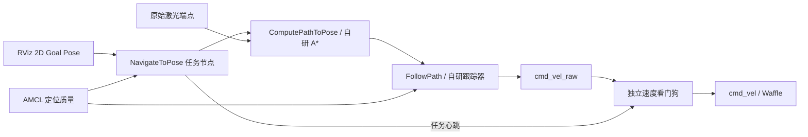

# 单目标导航任务

`mini_localization_astar.launch.py` 现在启动自研任务节点、规划器、跟踪器和独立速度看门狗。算法仍属于 `mini_nav_core`，三个 Action 复用 Jazzy 安装的 `nav2_msgs` 接口。



## 启动

构建新版本并停止原来的 launch 后启动，避免两个底盘速度发布者同时运行：

```bash
cd /home/a/ros2_ws
source /opt/ros/jazzy/setup.bash
colcon build --packages-select mini_nav_core mini_nav_nodes mini_nav_bringup mini_nav_rviz_plugins
source install/setup.bash
ros2 launch mini_nav_bringup mini_localization_astar.launch.py
```

默认 ROS domain 为 `61`，Gazebo partition 为 `mini_nav`，Waffle 模型、Cyclone DDS 和仿真时钟由 launch 设置。`use_rviz:=false` 关闭 RViz；`use_simulator:=false` 用于连接同域中已经启动的仿真。初始化定位并等待感知就绪后，用 **2D Goal Pose** 设置目标。RViz 导航状态面板显示任务状态、到实际规划终点的直线距离、耗时、重规划次数，并提供取消按钮。

另开终端运行 ROS CLI 时，仍需 source 和设置同一个 `ROS_DOMAIN_ID=61`、`RMW_IMPLEMENTATION=rmw_cyclonedds_cpp`。

## 接口与语义

| 接口 | 类型 | 行为 |
|---|---|---|
| `/navigate_to_pose` | `nav2_msgs/action/NavigateToPose` | 有身份的单目标任务；反馈、成功、失败、取消和新目标抢占 |
| `/compute_path_to_pose` | `nav2_msgs/action/ComputePathToPose` | 自研 A*，可显式提供起点；默认使用当前 TF |
| `/follow_path` | `nav2_msgs/action/FollowPath` | 自研跟踪器；取消或抢占时立即输出零速度 |
| `/goal_pose` | `geometry_msgs/msg/PoseStamped` | RViz 兼容入口，由任务节点转换为 Action |
| `/mini_nav/localization_valid` | `std_msgs/msg/Bool` | AMCL 激活、可信主簇、有限协方差、新鲜可用激光和 TF 缓存同时成立 |
| `/mini_nav/task_active` | `std_msgs/msg/Bool` | 任务节点持续发出的运动许可，稳态时钟下超时撤销 |
| `/mini_nav/control_diagnostics` | `std_msgs/msg/String` | JSON：实际候选、硬安全判定、余量评分、首个冲突与 TF/观测时间 |
| `/mini_nav/cmd_vel_raw` | `geometry_msgs/msg/TwistStamped` | 控制器候选速度；未经看门狗转发不进入底盘 |
| `/cmd_vel` | `geometry_msgs/msg/TwistStamped` | 只由看门狗发布，默认主 launch 中只有一个发布者 |
| `/mini_nav/set_navigation_enabled` | `std_srvs/srv/SetBool` | 统一暂停/启用任务入口；暂停终止任务，启用后必须提交新目标 |

当前任务入口使用 `map`、`odom`、`base_footprint`。支持的 planner/controller ID 为留空或 `AStar`、`AStarDynamic` / `PathTracker`；自定义行为树和其他 checker ID 会明确拒绝。Action 是标准接口，行为实现为本项目自研的单目标任务状态机。

暂停与启用：

```bash
export ROS_DOMAIN_ID=61 RMW_IMPLEMENTATION=rmw_cyclonedds_cpp
ros2 service call /mini_nav/set_navigation_enabled std_srvs/srv/SetBool '{data: false}'
ros2 service call /mini_nav/set_navigation_enabled std_srvs/srv/SetBool '{data: true}'
```

## 重规划、超时和停车

- 激光端点按扫描时间的 TF 转换一次，保留连续坐标；栅格用于索引、软代价与显示。静态障碍按整个方格面积检查，动态激光按连续点与额外误差预算检查。局部未知区仍禁行，不改变定位用 `/map`。
- 默认先以静态几何规划，局部立即检查动态命中；持续受阻才将稳定动态观测加入全局硬约束。A*、后处理与跟踪器使用同一连续圆盘扫掠入口，实际起点连接也必须安全。基础车体半径仍为 0.26 m，map 系另加显式的 0.03 m 定位预算；odom 局部保持基础半径。
- 默认前视弧长仍为 `0.35 m`。若到前视点的直线捷径不安全，但最近投影到该点的原折线及起点连接均安全，则沿同一折线逐次缩短前视弧长；路径本身受阻时仍按原候选扫掠、恢复期限和停车处理。前视点通过检查不代替最终速度圆弧与制动范围的双几何检查。
- 名义候选不安全时尝试少量合法差分候选并完整检查；`avoiding_obstacle` 允许安全替代运动并请求重规划，单轮替代最多 3 s。无候选则持续零速；不默认执行倒车或初始重叠脱离。
- 受阻或偏离路径时，任务节点至多每 `1 s` 请求一次新规划。规划前撤销许可并取消旧 FollowPath，旧 UUID 的迟到结果不会结束新目标。未获得新有效路径时不会恢复旧路径的运动许可。原目标无法到达时保留原有 `0.5 m` 内最近可达终点逻辑。
- 持续受阻或无位移/转角进展 `20 s` 后失败，整体任务 `180 s` 后失败；等待规划或跟踪服务器响应超过 `3 s` 后失败。期限使用稳态时钟，不因重新规划重置。
- 控制器仅在拥有当前 FollowPath 目标、定位与地图新鲜、TF 可用时输出运动。重新定位、地图变化或暂停会终止当前导航任务；恢复后不自动续跑旧目标。
- 看门狗每 `20 ms` 检查命令和任务心跳，`0.35 s` 超时输出零速度；仿真时钟停滞、跳回、非法命令同样停车。控制器冻结或进程退出时，其持续发布零速度的能力不是停车前提。
- 正常命令采用线速度加速度 `0.30 m/s²`、减速度 `0.50 m/s²`、角加速度 `1.0 rad/s²`，在速度限幅之后检查实际候选运动的扫掠。碰撞风险与失效停车直接置零；底盘实际制动由动力学决定。
- 碰撞预测包含输入失效等待时间和候选速度的制动距离。看门狗不再平滑速度，避免转发与控制器检查不同的轨迹。

## 验证与边界

复现隔离任务测试：

```bash
source /opt/ros/jazzy/setup.bash
source /home/a/ros2_ws/install/setup.bash
cd /home/a/ros2_ws
colcon test --packages-select mini_nav_core mini_nav_nodes mini_nav_bringup mini_nav_rviz_plugins --event-handlers console_cohesion+
colcon test-result --verbose
```

任务集成测试固定 domain `217`，RViz 固定 domain `212`，拒绝把测试运动指令发进默认导航域。RViz 测试需要可用 X11/OpenGL 环境。

当前版本提供完整的基础单目标任务闭环。未实现 Nav2 全部行为树、控制器插件、多目标任务、路径速度反馈闭环、统一 Lifecycle cleanup、实时调度和硬件急停。AMCL KLD 仍是简化自适应算法，beam-skip 和位姿持久化等兼容参数不能据此认定已实现。独立看门狗自身或 Gazebo bridge 故障时，仍需底盘驱动层命令超时，不能把软件看门狗当作硬件急停。

实现与实测记录见 [本轮报告](../logs/26-9-30/navigation_completion_implementation.md)。
